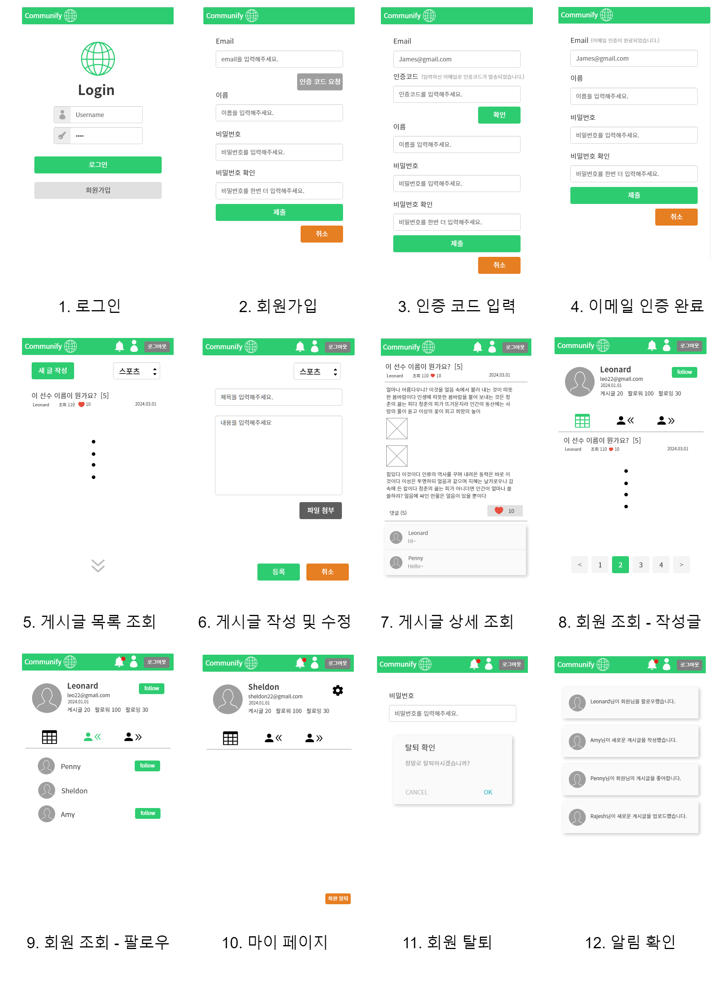
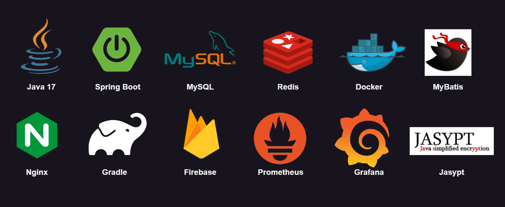
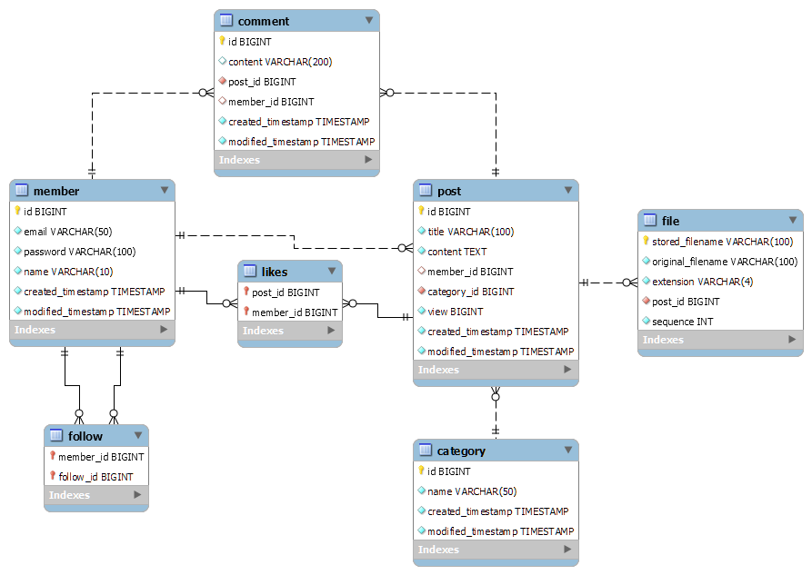
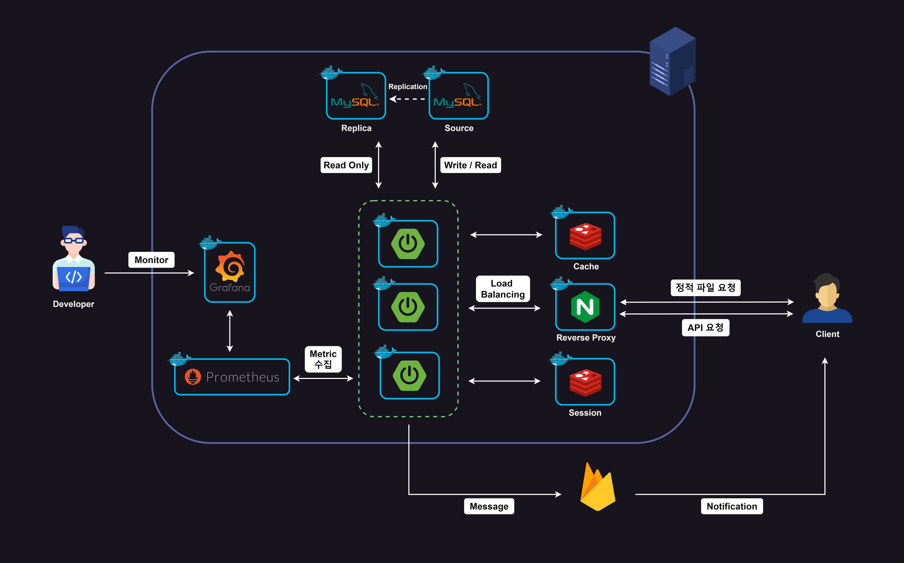

# 🌏 Communify

- 커뮤니티 사이트를 개발하는 프로젝트
- 대용량 트래픽을 가정하여 성능에 초점을 두고 개발 진행

## 🎯 Technical Issue

- Redis 캐시를 활용한 읽기 작업 성능 향상
- Redis 캐시 저장소, 세션 저장소 분리
- Write Behind 전략을 활용해 게시글 좋아요, 조회 수 집계 구현
- Redis Transaction을 사용해 Redis에 다수 접근하는 기능을 atomic하게 구현
- DB 이중화(MySQL Replication)를 통한 데이터베이스 부하 분산
- DB 인덱스 설정을 통해 조회 성능 향상
- Bulk Insert를 이용한 데이터 삽입 성능 향상
- 무한 스크롤 방식의 페이징 처리를 통해 게시글 목록 조회 성능 향상
- FireBase를 이용한 푸시 알림 기능
- 비동기 방식을 적용해 푸시 알림 기능 향상
- Spring AOP를 사용한 로그인 체크 기능
- Nginx의 Reversed-Proxy를 이용하여 로드밸런싱
- Jasypt를 이용해 설정 정보 암호화

## 🖼️ Application UI

## 🛠️ 사용한 기술 및 개발 환경

## 📈 ERD

## 🏛️ 프로젝트 구조도

## ⚙️ 주요 기능

### 🙋🏻‍♂️ 회원

- 이메일 인증을 통한 가입
- 패스워드 인증을 통한 탈퇴
- 로그인, 로그아웃
- 회원 조회
- 다른 회원 팔로우

### 📝 게시글

- 게시글 작성
- 카테고리별 게시글 목록 조회
- 게시글 상세 조회
- 게시글 수정
- 게시글 삭제
- 게시글 좋아요 및 좋아요 취소

### 💬 댓글

- 댓글 작성
- 게시글별 댓글 조회
- 댓글 수정
- 댓글 삭제

### 🔔 푸시 알림

- 다른 사람이 자신을 팔로우한 경우
- 팔로우 중인 사람이 게시글을 작성한 경우
- 다른 사람이 자신의 게시글에 댓글 작성한 경우
- 다른 사람이 자신의 게시글에 좋아요 버튼을 누른 경우
